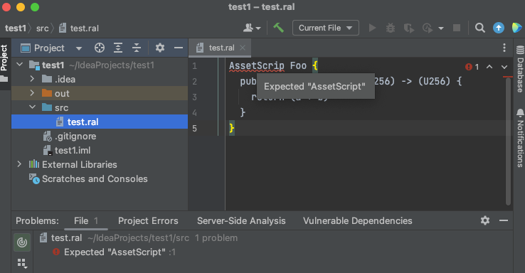
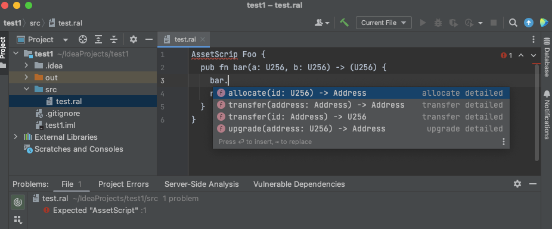

# ralph-lsp

Language server for Ralph.

Currently supports text document level events and diagnostics.

# Dependency on `ralphc`

Checkout branch [lsp_publish_ralphc](https://github.com/alephium/dev-alephium/tree/lsp_publish_ralphc) and publish it locally.

```shell
sbt publishLocal
```

Update `alephium-ralphc` version in [Dependencies.scala](/project/Dependencies.scala) with the published version.

# Build the jar

```shell
sbt "project lsp-server; assembly;"
```

Look in `target` folder: `.../ralph-lsp/lsp-server/target/scala-2.13/ralph-lsp.jar`

# Configuration

Create a mandatory config file named `build.ralph` in your project's root directory. You can use the following sample as reference:

`build.ralph`

```
{
  "compilerOptions": {
    "ignoreUnusedConstantsWarnings": false,
    "ignoreUnusedVariablesWarnings": false,
    "ignoreUnusedFieldsWarnings": false,
    "ignoreUnusedPrivateFunctionsWarnings": false,
    "ignoreUpdateFieldsCheckWarnings": false,
    "ignoreCheckExternalCallerWarnings": false
  },
  "contractPath": "./contracts",
  "artifactPath": "./artifacts"
}
```

# Run LSP in VSCode

Update the jar
location [here](plugin-vscode/src/extension.ts).

Run the IDE:

```shell
cd plugin-vscode
code .
```


# Run LSP in neovim

Install the [ralph.vim](https://github.com/tdroxler/ralph.vim) plugin with your favorite plugin manager, for file type detection, highlighting, etc.

## [nvim-lspconfig](https://github.com/neovim/nvim-lspconfig)

Add the following to your lua configuration

```
local function ralph_init()
   vim.lsp.start({
     name = 'ralph-lsp',
     cmd = {'java', '-jar', '<path-to-your-jar>/ralph-lsp.jar'},
     root_dir = vim.fs.dirname(vim.fs.find({'build.ralph'}, { upward = true })[1])
   })
end

vim.api.nvim_create_autocmd('FileType', {
    pattern = { 'ralph' },
    callback = function() ralph_init() end
})
```

# Run LSP in IntelliJ (Ultimate)

Update the jar
location [here](plugin-intellij/src/main/scala/org/alephium/ralph/lsp/plugin/intellij/RalphLspServerDescriptor.scala).
Yep, this will eventually be automatically configured via sbt.

Run the IDE:

```shell
sbt "project plugin-intellij; runIDE"
```

## Error highlighting

Note: Currently this is implemented for when files are
opened. See [didOpen()](lsp-server/src/main/scala/org/alephium/ralph/lsp/server/service/RalphTextDocumentService.scala).



## Code completion


