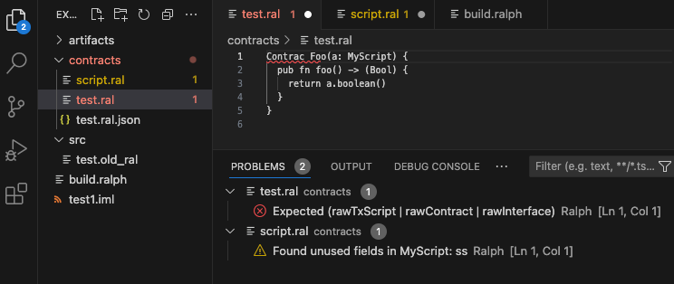

# ralph-lsp

Language server for Ralph.

Currently supports text document level events and diagnostics.

# Build the jar

```shell
sbt "compile; lsp-server/assembly"
```

Look in `target` folder: `.../ralph-lsp/lsp-server/target/scala-2.13/ralph-lsp.jar`

# Run LSP in VSCode

Update the jar
location [here](plugin-vscode/src/extension.ts) and ensure a folder is specified for the logs under the
flag `-DRALPH_LSP_HOME`.

Run the IDE:

```shell
cd plugin-vscode
code .
```



# Run LSP in neovim

Install the [ralph.vim](https://github.com/tdroxler/ralph.vim) plugin with your favorite plugin manager, for file type detection, highlighting, etc.

## [nvim-lspconfig](https://github.com/neovim/nvim-lspconfig)

Add the following to your lua configuration

```lua
local function ralph_init()

  local capabilities = vim.lsp.protocol.make_client_capabilities()

  capabilities.workspace.didChangeWatchedFiles.dynamicRegistration = true

  local root_dir = vim.fs.dirname(vim.fs.find({'ralph.json', 'contracts', 'artifacts'}, { upward = true })[1])
  if root_dir == nil then root_dir = vim.fn.getcwd() end

   vim.lsp.start({
     name = 'ralph-lsp',
     cmd = {'java', '-jar', '-DRALPH_LSP_HOME=<path-to-your-log-folder>', '<path-to-your-jar>/ralph-lsp.jar'},
     root_dir = root_dir,
     capabilities = capabilities
   })

end

vim.api.nvim_create_autocmd('FileType', {
    pattern = { 'ralph' },
    callback = function() ralph_init() end
})
```

# Configuration

After your IDE has booted up, create a mandatory config file named `ralph.json` in your project's root directory.
You can use the following sample as reference:

```json
{
  "compilerOptions": {
    "ignoreUnusedConstantsWarnings": false,
    "ignoreUnusedVariablesWarnings": false,
    "ignoreUnusedFieldsWarnings": false,
    "ignoreUnusedPrivateFunctionsWarnings": false,
    "ignoreUpdateFieldsCheckWarnings": false,
    "ignoreCheckExternalCallerWarnings": false
  },
  "contractPath": "contracts",
  "artifactPath": "artifacts"
}
```

## Configure trace (VSCode)


- `off` - Enables `info`, `warning` and `error`.
- `messages` - Enables all the above including `debug`.
- `verbose` - Enables all the above including `trace`.
